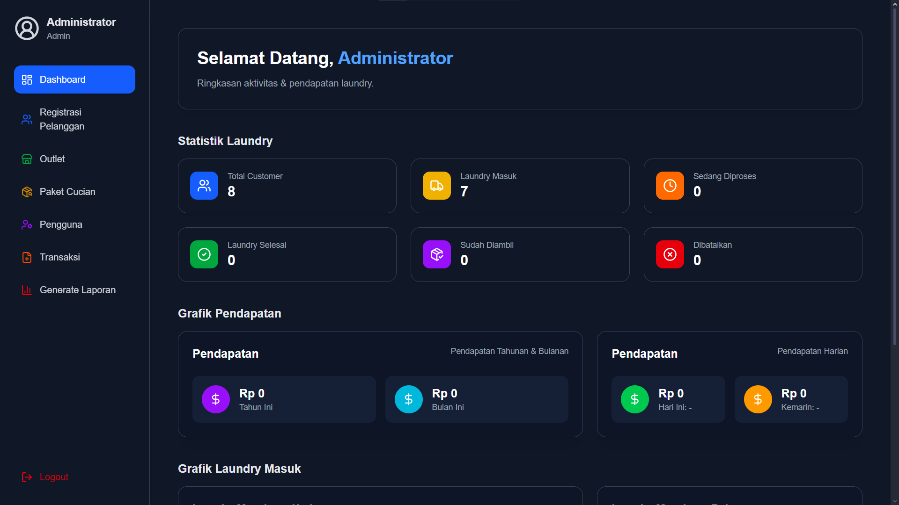
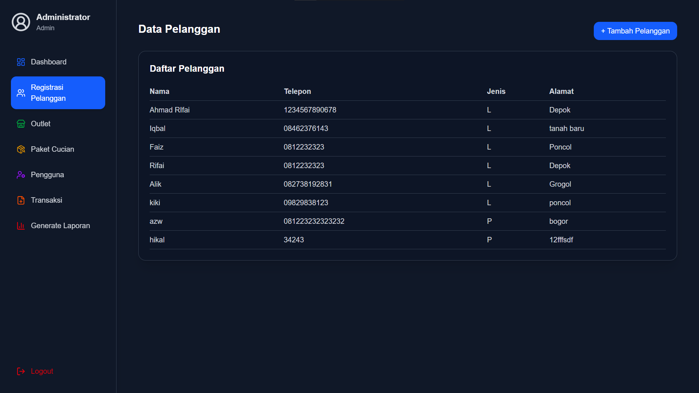
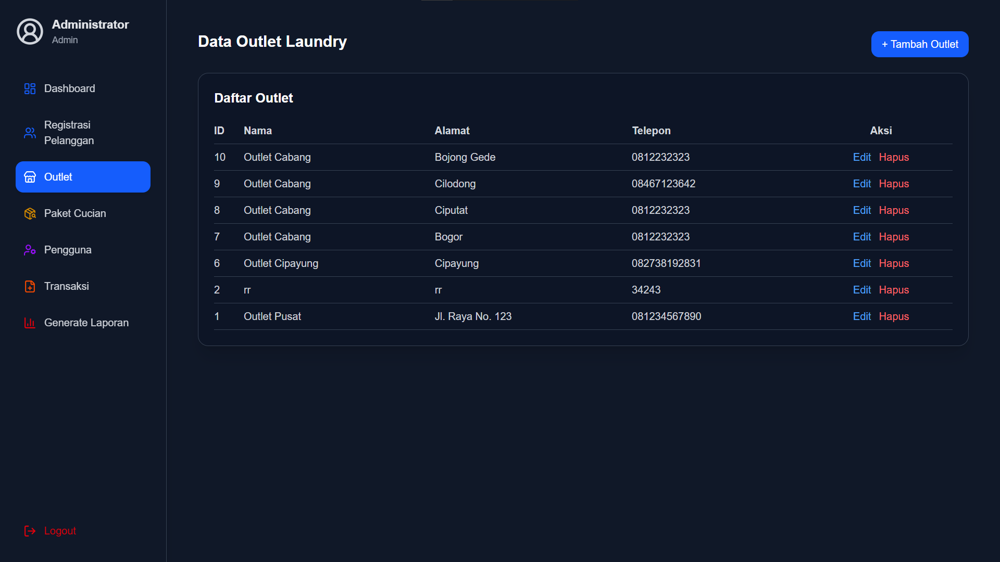
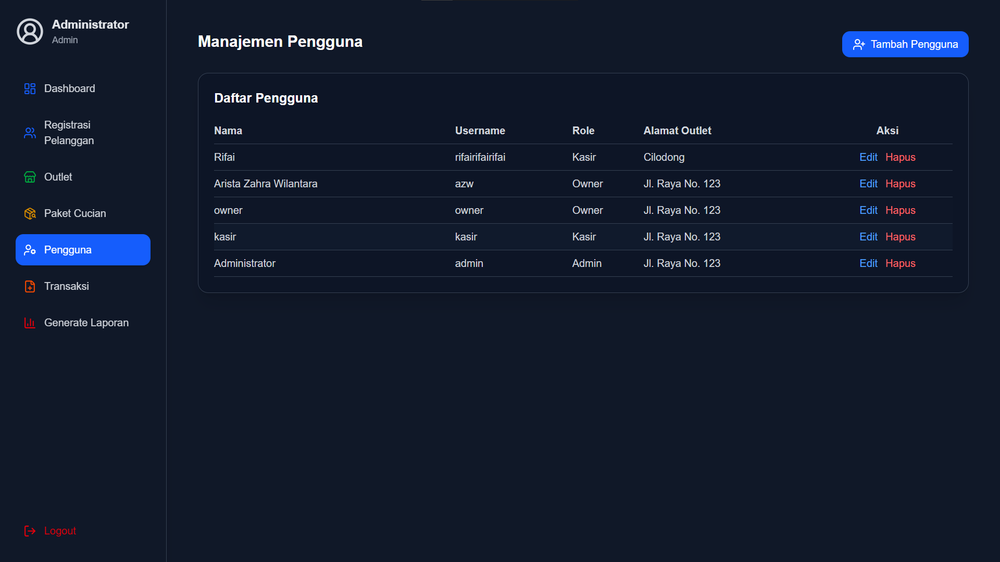
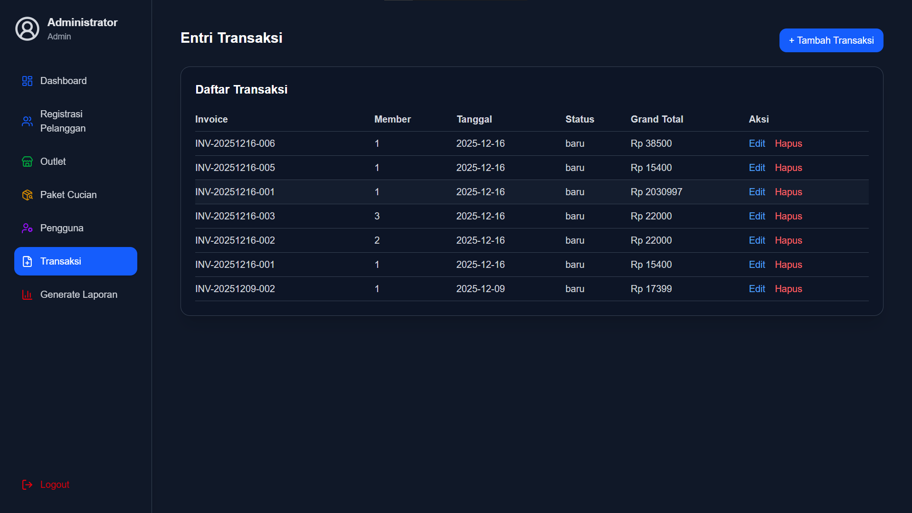
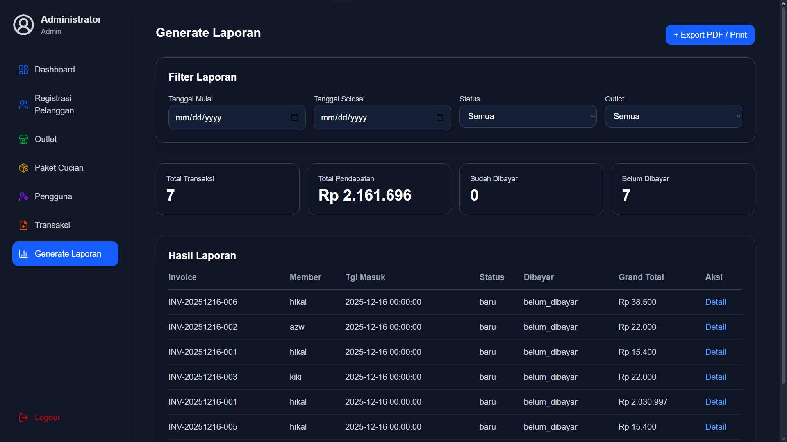
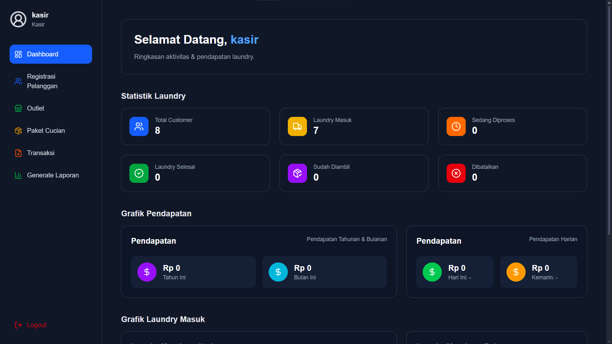
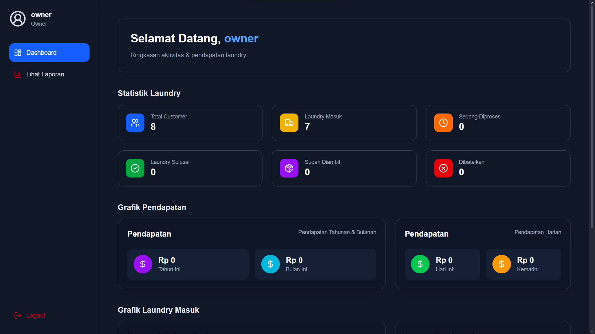

# Laundry App

A comprehensive web-based laundry management system designed to streamline operations for laundry businesses. This application provides dedicated dashboards for Administrators, Cashiers, and Owners to manage transactions, customers, and business performance efficiently.

🔗 **[Live Demo](https://laundry-app-gold.vercel.app)**

Login as Admin
- **Username:** admin
- **Password:** admin123

Login as Cashier
- **Username:** kasir
- **Password:** kasir123

Login as Owner
- **Username:** owner
- **Password:** owner123

## 🚀 Tech Stack

Built with modern web technologies for performance and scalability:

- **Framework:** [Next.js 16](https://nextjs.org/)
- **Language:** [TypeScript](https://www.typescriptlang.org/)
- **Styling:** [Tailwind CSS](https://tailwindcss.com/)
- **Database:** [Neon (PostgreSQL)](https://neon.tech/)
- **ORM:** [Drizzle ORM](https://orm.drizzle.team/)
- **Authentication:** [NextAuth.js](https://next-auth.js.org/)
- **Icons:** [Lucide React](https://lucide.dev/)

## ✨ key Features

### 1. Dashboard Administrator
Manage the core aspects of the laundry business including master data and user roles.
- **User Management**: Manage admins, cashiers, and owners.
- **Master Data**: Manage products/services and categories.
- **Reporting**: View overall business stats.









### 2. Dashboard Kasir (Cashier)
Streamlined interface for day-to-day transactions.
- **Transaction Processing**: Create and detailed laundry orders.
- **Invoicing**: Generate invoices for customers.
- **Customer Management**: Add and manage customer details.



### 3. Dashboard Owner
Insights for business owners to track performance.
- **Financial Reports**: View income and transaction summaries.
- **Performance Metrics**: Analyze business growth.



## 🛠️ Getting Started

Follow these steps to run the project locally:

1. **Clone the repository**
   ```bash
   git clone https://github.com/rifai27077/laundry-app.git
   cd laundry-app
   ```

2. **Install dependencies**
   ```bash
   npm install
   # or
   yarn install
   # or
   pnpm install
   ```

3. **Environment Setup**
   Create a `.env` file in the root directory and configure your environment variables (Database URL, NextAuth secret, etc.).

4. **Run Database Migrations**
   ```bash
   npm run db:push
   # or relevant drizzle command
   ```

5. **Run the Development Server**
   ```bash
   npm run dev
   ```

   Open [http://localhost:3000](http://localhost:3000) with your browser to see the result.

## 📄 License

This project is licensed under the MIT License.
